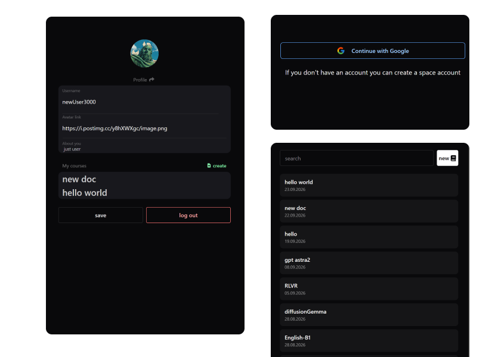
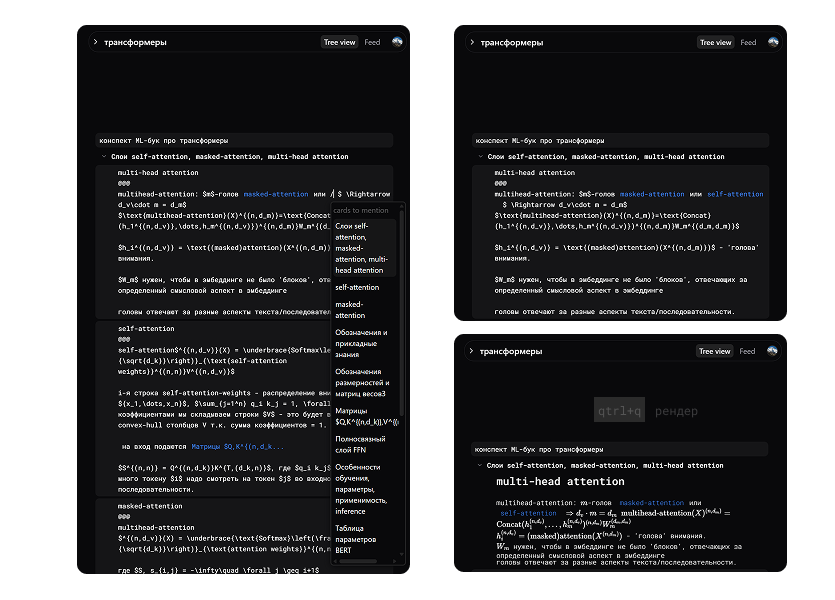
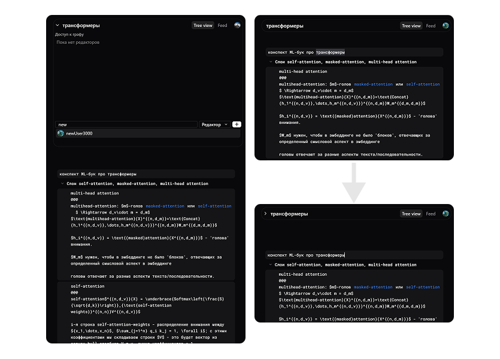
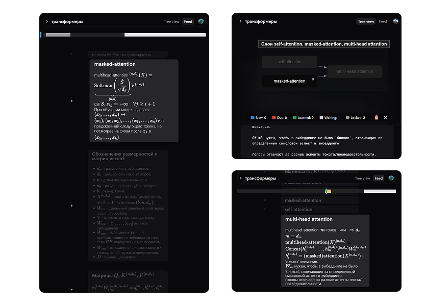
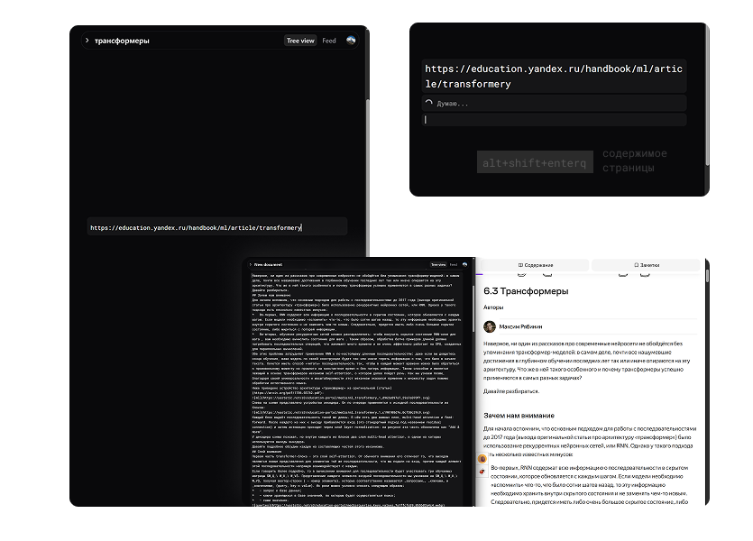
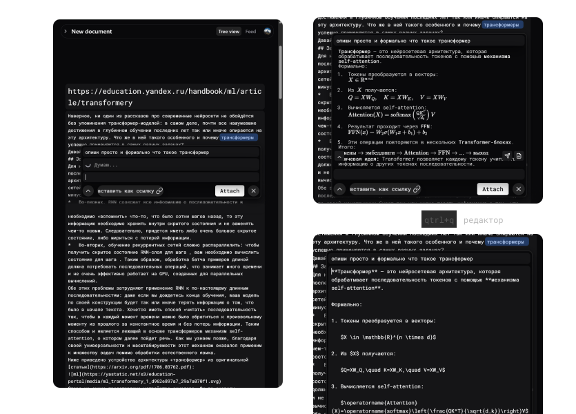

# Модуль ленты и Space-фронтенд

## Запуск фронтенда

```bash
git clone https://github.com/mchlkrpch/shift.git
cd shift/shiftFront
npm install
npm run dev
```

Приложение запустится локально.

> **Внимание!** Не публикуйте конфиденциальную информацию. Содержимое графов видно всем: это публичные заметки, которые другие участники могут использовать для повторения материала.

> Фронтенд создавался на добровольной и некоммерческой основе, «ради вайба» и для ведения личных заметок, в свободное от работы время. Если вы заметите баг, автор будет благодарен за сообщение с описанием проблемы.

> Фронтенд предназначен для записи учебной информации. Информация другого характера может быть удалена.

## Авторизация и профиль

Войти можно через аккаунт Google. В профиле можно указать информацию о себе, а на странице графов — посмотреть конспекты пользователей.



## Создание и редактирование графа

Чтобы создать граф, перейдите в `/profile` и нажмите `create`. Откроется новый граф, в котором можно писать заметки.

Чтобы сохранить конспект, нажмите `Ctrl+S`. Чтобы указать связь с картой-пререквизитом, нажмите `/` — появится список карт, на которые можно сослаться.

Чтобы посмотреть, как будет выглядеть карта, нажмите `Ctrl+Q`. Редактор поддерживает KaTeX, код и базовую разметку Markdown.



Чтобы редактировать заметку вместе с друзьями, добавьте их через меню `collaborators` в левом верхнем углу.

Нажмите `Ctrl+G`, чтобы создать группу карт и задать ей название. Нажатие на группу или карту с зажатой клавишей `Alt` добавляет визуализацию графа с указанием пререквизитов.



## Повторение материала

По созданному графу можно запустить повторение материала.



## Импорт веб-страниц и статей

Можно загрузить содержимое веб-страницы или статьи по ссылке. Для этого вставьте в текстовый блок только ссылку и нажмите `Alt+Shift+Enter`.



## Работа с нейросетью

Если у вас есть доступ к API нейросети, выделите слово или фрагмент текста в заметке и нажмите `Alt`. Выделенный текст попадёт в промпт, а под ним появится всплывающее окно.



Нажмите `Ctrl+Enter`, чтобы отправить содержимое в нейросеть и получить ответ. Чтобы перейти к редактированию ответа, нажмите `Ctrl+Q`.
